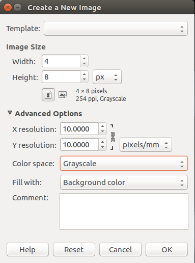
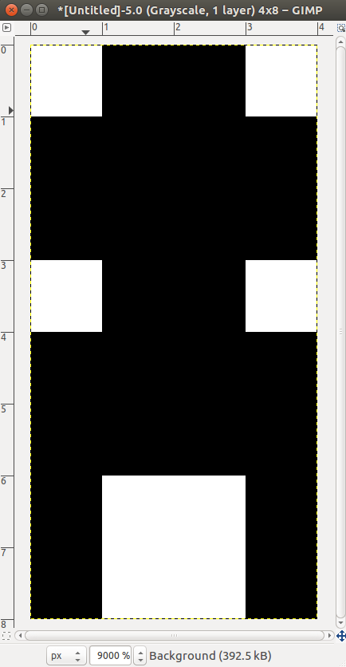
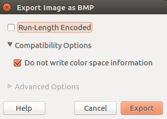

# Ti8X Z80 ASM Project Euler Programs
### by zackpi

## SPASM-ng Documentation
### Pre-Operations (preops)
#### define (defcont), undefine (undef)
Create or remove constants to be used during assembly. Defines can be set to equal a value, given as the second operand, or they can just be defined to exist. The `#defcont` preop continues the value expression of the last define on a new line--this might be useful for making more complicated defines pretty. The `#undefine` preop and its alias `#undef` make it so the constant is no longer defined.

```
#define progStart $9D00
#defcont          + $95       ; continued the define statement
.org progStart-2              ; evaluates to $9D93

#undefine progStart           ; could have also used #undef
#ifdef progStart
.echo "this won't print"
#endif
```

#### include
Performs a first pass of the contents of the file pointed to by the path in its argument. An included file usually has useful macros, defines, and equates that can be used in your source during the second pass (or later in the first pass if you included the file at the top of your source).

```
#include "ti83plus.inc"
; code
```

You can also include black-and-white bitmaps (.bmp image files) as follows:

```
#include "artwork.bmp"
```

The bitmap must be black-and-white (1-bit grayscale) and the bitmap header can't include the color space information, so there are a lot of restrictions with this. Also, the format prefers 8xN data and will pad the data with 0's to make it wide enough to fit in a byte, even if it's 4xN like this:

<pre>
60   ; 0 <b>1 1</b> 0  0 0 0 0  <- padding on the right
F0   ; <b>1 1 1 1</b>  0 0 0 0
F0   ; <b>1 1 1 1</b>  0 0 0 0
60   ; 0 <b>1 1</b> 0  0 0 0 0
F0   ; <b>1 1 1 1</b>  0 0 0 0
F0   ; <b>1 1 1 1</b>  0 0 0 0
90   ; <b>1</b> 0 0 <b>1</b>  0 0 0 0
90   ; <b>1</b> 0 0 <b>1</b>  0 0 0 0
</pre>

Here's how I created the above bitmap using GIMP, but you could probably find many other editors that output the bitmap format that SPASM accepts.

<div style=
     "
          display: block; 
          justify-content: space-between; 
          align-items: center;
     "
>
     
     
     
</div>

Here's how an assembled 8x16 sprite looks in bytecode:

<pre>
3C   ; 0 0 <b>1</b> <b>1</b> <b>1</b> <b>1</b> 0 0
42   ; 0 <b>1</b> 0 0 0 0 <b>1</b> 0
6A   ; 0 <b>1</b> <b>1</b> 0 <b>1</b> 0 <b>1</b> 0
42   ; 0 <b>1</b> 0 0 0 0 <b>1</b> 0
3C   ; 0 0 <b>1</b> <b>1</b> <b>1</b> <b>1</b> 0 0
18   ; 0 0 0 <b>1</b> <b>1</b> 0 0 0
66   ; 0 <b>1</b> <b>1</b> 0 0 <b>1</b> <b>1</b> 0
A5   ; <b>1</b> 0 <b>1</b> 0 0 <b>1</b> 0 <b>1</b>
A5   ; <b>1</b> 0 <b>1</b> 0 0 <b>1</b> 0 <b>1</b>
A5   ; <b>1</b> 0 <b>1</b> 0 0 <b>1</b> 0 <b>1</b>
A5   ; <b>1</b> 0 <b>1</b> 0 0 <b>1</b> 0 <b>1</b>
3C   ; 0 0 <b>1</b> <b>1</b> <b>1</b> <b>1</b> 0 0
24   ; 0 0 <b>1</b> 0 0 <b>1</b> 0 0
24   ; 0 0 <b>1</b> 0 0 <b>1</b> 0 0
24   ; 0 0 <b>1</b> 0 0 <b>1</b> 0 0
66   ; 0 <b>1</b> <b>1</b> 0 0 <b>1</b> <b>1</b> 0
</pre>


#### if (elif, ifdef, ifndef), else, endif
The `#if` and `#elif` preops allow you to control what parts of the source code get assembled based on the boolean value of their operands. The `#ifdef` and `#ifndef` preops work the same except they resolve to true when their operand has been defined or has not been defined respectively. The `#else`, and `#endif` preops define the true blocks and false blocks that get assembled or ignored as a result of the `#if` boolean tests.

For example, assembling the code below with `spasm -DDEBUG test.z80 test.bin` will include the call to `debug_prt`. Assembling it with `spasm test.z80 test.bin` will ignore the call and simply `ret`.

```
#ifdef DEBUG
     call debug_prt
     .db "this is a debug print",0
     ret                      ; gets assembled if DEBUG is defined
#else
     ret                      ; only gets assembled during production
#endif
```

There are infinite ways to construct complicated examples of if-skeletons, so I won't show them all but you can figure out where is best for you. Here's just one more, an example of an [include guard](https://en.wikipedia.org/wiki/Include_guard):

*tester.inc*:
```
#ifndef TESTER_INC
#define TESTER_INC
test:     ret
#endif
```

Even if you put `#include "tester.inc"` several places in your code, it will only be included one time because after the first time `TESTER_INC` will be defined and the `#ifndef` will resolve to false, skipping the whole file.

#### comment, endcomment
The assembler ignores the block of code between `#comment` and `#endcomment`, allowing for large and unformatted comments.

<pre>
#comment   ____          <a href="https://www.asciiart.eu/art-and-design/escher">this isn't mine</a>
          /   /\
         /___/  \
        /   /\  /\
       /   /  \/  \
      /   /   /\   \
     /   /   /  \   \
    /   /   /\   \   \
   /   /   /  \   \   \
  /___/___/____\   \   \
 /   /          \   \  /\
/___/____________\___\/  \
\   \             \   \  /
 \___\_____________\___\/
#endcomment
</pre>

#### macro, endmacro
Creates a macro function that performs blind string replacements of its arguments before the code is assembled. These can be simple or arbitrarily complex.

```
#macro ntstr(value)      ; create a null-terminated string
     .db value,0
#endmacro

ntstr("hello")           ; .db "hello",0
```

#### import
Used for importing binaries directly into the source code. Can be used for sprites and look-up tables. In the case below, *msg* is an ASCII-encoded file, so `#import msg` is effectively the same as `.db "super cool message thingy"` and indeed the message prints as expected.

```
#include  "ti83plus.inc"
.org $9D93
.db  t2ByteTok,tAsmCmp

     bcall(_ClrLCDFull)
     ld HL, 0
     ld (CurRow), HL
     ld HL, Message
     bcall(_PutS)        ; Displays the string
     bcall(_NewLine)
     ret

Message:
#import   "msg"
.db 0
```

*msg*:
```
super cool message thingy
```

#### region, endregion
These are valid preops according to the SPASM source code but they don't do anything.


### Directives
#### db (byte), dw (word), dl (long)
Place bytes, words, or longs (double-words) into code memory at the current location. The `.byte`, `.word`, and `.long` directives are aliases for `.db`, `.dw`, and `.dl`, respectively.

```
.db	3, $F5, 17 
.db "null-terminated string",0
.byte 3, $F5, 17	; same thing

.dw 65535, $C0DE
.word 65535, $C0DE	; same thing

.dl $DEADBEEF
.long $DEADBEEF	    ; same thing
```

#### nolist, list
These determine what portions of the code should be included in a listing file, which is intended to allow you to compare assembly to bytecode. Usually put `.nolist` before includes and defines and `.list` before the code segment

```
.nolist
#include "file.inc"
#define VALUE

.list
	ret
```

The above yields the following listing file, where you can see `ret` has been assembled as `C9`:

```
6 00:0000 C9 -  -  -      ret
```

#### org
This tells the assembler to set the program counter to the two-byte address passed as its argument. The actual address that labels correspond to are all calculated based on the value in PC. Therefore, `.org` can be used to set the position of certain blocks of code in memory. It should also be used at the beginning of the program to tell the assembler where in memory the code will be loaded and executed from (`9D93` for Ti calculators). Can also be used to leave space between code blocks in a larger program

```
.org $9D93		; PC <- $9D93
```

#### fill, block
Fills a region of memory starting at the current value of PC with a constant value, and increments PC to start at the next byte after the fill block. The first argument specifies the number of bytes to fill. The optional second argument specifies the value to fill with. If no second argument is given the region is filled with 0. The `.fill` and `.block` directives are aliases for each other, so they do the exact same thing

```
.fill 256, $AB	     ; fills 256 bytes with $AB
.fill 10		; fills 10 bytes with 0

.block 256, $AB
.block 10		; the same thing
```

#### end
Specifies the end of the source code. Can be used to place a text segment at the end for documentation or an appendix. ~~Everything else after the `.end` directive will be ignored.~~ (This should be the functionality of `.end` but as of the latest version of SPASM-ng it ignores the directive completely. Good practice to leave it in for readability) 

```
.org $9D93
	ret
.end

.db "this shouldn't get assembled", 0
.db "but it does as of current version :(", 0
```

#### addinstr
Creates a new opcode and takes the following parameters:

```
.addinstr mnemonic args instr_data size [class extended end_data] 
```

* `mnemonic` is a word like "add" that indicates what the instruction does.
* `args` is a comma-separated list of the arguments 
* `instr_data` is the hex code that the opcode assembles to (For `ret` this would be `C9`)
* `size` is the number of bytes the instruction takes up in memory (can be greater than length of `instr_data`+`end_data`)
* `class` and `extended` are not used and can be omitted unless you want to specify `end_data`
* `end_data` is a single hex byte that will be placed after `instr_data` in the assembled bytecode

SPASM's `.addinstr` code supports `instr_data` up to 8 bytes in size, but due to a conflict with SPASM's pass-one parser, literals of size greater than 4 bytes are not possible so the `instr_data` field is limited to 4 bytes. However, as shown in the example below, 5 bytes are possible by specifying the single-byte `end_data` to be placed after a max-length `instr_data` segment.

```
.nolist
.addinstr swap A,B A8A8A8 3
.addinstr supret "" C9C9C9C9 5 cls ext C9

.list
	swap A,B
	supret
```

The above code produces the following listing:

```
6 00:0000 A8 A8 A8 -  	swap A,B
7 00:0004 C9 C9 C9 C9 
          C9 -  -  -  	supret
```

Here are some useful instructions:

<pre>
.addinstr swap A,B A8A8A8 3		; <a href="https://en.wikipedia.org/wiki/XOR_swap_algorithm">XOR swap algorithm</a>
.addinstr swap A,C A9A9A9 3
.addinstr swap A,D AAAAAA 3
.addinstr swap A,E ABABAB 3
.addinstr swap A,H ACACAC 3
.addinstr swap A,L ADADAD 3
.addinstr clr A AF 1			; A xor A = 0
</pre>

They're saved in a file called [*extops.inc*](src/inc/extops.inc) which you can include in your code and use like so:

```
#include "extops.inc"
	clr A						; not in the standard opcode set
	ret
```

#### echo
Print a value or string to a file or stderr during assembly.

```
.echo "Writing to stderr"
.echo > rel/path "Writing to this file"
.echo >> rel/path "Appending to this file"
.echo > /home/abs/path "Writing to absolute path file"
.echo >> /home/abs/path "Appending to absolute path file"

```

#### error
Print a value or string to stderr during assembly.

```
.error "err_string"
```

#### equ
Create an equate for a constant value. Each place in the source code where `ALIAS` is found, the constant value is substituted. Equates can be used in expressions, and likewise, expressions can be used as the constant value for an alias as long as the value is predetermined at assembly-time.

```
ALIAS 	.equ 64
PLUS1 	.equ 1+ALIAS
	ld A, PLUS1
```

#### show
Shows the string value of a define, so no text replacement is performed before printing the value (see `apple` below). Does not work with equates.

```
#define	progStart	$9D95
#define apple progStart-2
.show apple
```

The above code prints `APPLE: progStart-2` in the command line during assembly.

#### option
Create multiple defines in one line. Each `name=expr` pair will create a define with `__name` evaluating to `expr`. Several pairs can be chained together.

```
.option apple=56,orange=tacos,bagel="flamingo"
.show __apple
.show __orange
.show __flamingo
```

The above code prints the following during assembly:

```
__APPLE: 56
__ORANGE: tacos
__BAGEL: "flamingo"
```

#### seek
Moves the program counter to the specified 2-byte absolute address. Also moves the `out_ptr` which controls where the file ends to the value specified, so without the last line below, the program would end after `$9E20`, but with it the program ends at `$9E40` as intended.

```
.list
.org $9E00
.block 64,1
.seek $9E20		; place PC into center of .block segment
.db $FF
.seek $9E40		; sets the end of the program properly
```

Make sure to read carefully when looking at the listing file, since the addresses at the left are not always in order when using `.seek`. Check the addresses of lines 4 and 5.

<pre>
1 00:0000 -  -  -  -  .list
2 00:0000 -  -  -  -  .org $9E00
3 00:9E00 01 01 01 01 
          01 01 01 01 
          01 01 01 01 
          01 01 01 01 
          01 01 01 01 
          01 01 01 01 
          01 01 01 01 
          01 01 01 01 
          01 01 01 01 
          01 01 01 01 
          01 01 01 01 
          01 01 01 01 
          01 01 01 01 
          01 01 01 01 
          01 01 01 01 
          01 01 01 01 .block 64,1
4 <b>00:9E40</b> -  -  -  -  .seek $9E20
5 <b>00:9E20</b> FF -  -  -  .db $FF
6 00:9E21 -  -  -  -  .seek $9E40
</pre>

However, a `hexdump` of the assembled binary shows that the operation was indeed performed properly--that is, an `$ff` appears in the middle of the `.block` segment.

<pre>
00000000  01 01 01 01 01 01 01 01  01 01 01 01 01 01 01 01
00000010  01 01 01 01 01 01 01 01  01 01 01 01 01 01 01 01
00000020  <b>ff</b> 01 01 01 01 01 01 01  01 01 01 01 01 01 01 01
00000030  01 01 01 01 01 01 01 01  01 01 01 01 01 01 01 01
</pre>

#### assume
Can be used to set ADL to 0 or 1 (only useful for eZ80 programming). Takes arguments in the following format:

```
.assume name=value
```

But I believe `.assume ADL={0 or 1}` is the only way this is used at the moment.